<div align="center">


</div>

<div align="center">


</div>

<div align="center">

`Full-Stack Engineer` &nbsp;·&nbsp; `AI / ML` &nbsp;·&nbsp; `Web3` &nbsp;·&nbsp; `Open Source`

<br/>

[](https://www.linkedin.com/in/jatin-sharma-556a59301/)
&nbsp;
[](https://x.com/JatinSharmaa22)
&nbsp;
[](mailto:sharma.jatin2202@gmail.com)

</div>

<br/>

```js
const jatin = {
  role     : "Full-Stack & AI/ML Engineer",
  stack    : [ "React", "Next.js", "TypeScript", "Node.js", "Rust" ],
  ai       : [ "Deep Learning", "Big Data", "AI Systems Design" ],
  mobile   : "React Native",
  web3     : "Solana Ecosystem",
  finance  : "AI-Driven Financial Systems",
  values   : {
    architecture : "Clean",
    code         : "Maintainable",
    systems      : "Scalable"
  },
  location : "Mountain-based · Building Globally",
  motto    : "Performance over hype."
}
```

<br/>

---

### Languages

<div align="center">


</div>

### Frameworks & Runtime

<div align="center">


</div>

### AI / ML & Data Science

<div align="center">


</div>

### Databases

<div align="center">


</div>

### Cloud & DevOps

<div align="center">


</div>

---


<div align="center">



</div>

---

<div align="center">


</div>

<br/>

<div align="center">


</div>
